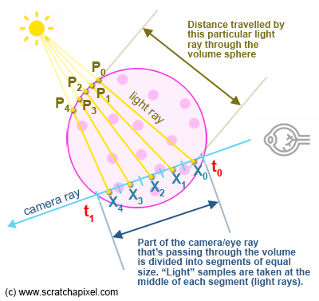

A demonstration of absorption. A spherical body sits between a coloured back wall and the camera
The absorption coefficient $\sigma_a$ can adjusted by the user as can the colours of the wall and participating media.

This builds on exercide 1 by adding lighting (and considering scattering) See the diagram below
from www.scratchapixel.com

We need to integrate the light that's be redirected towards the eye due to in-scattering along the segment of the ray
that passes through the volumetric object. We will divide the section of the camera ray that's passing through the
volume into a certain number of segments (our samples if you wish) and compute how much light arrives at the center of
each one of these segments (sample) using the following procedure (see Figure 6 for a visual representation of the
concept):

We shoot a ray from that sample point (let's call it X) toward the light source to compute the distance from the sample
point to the sphere boundary (let's call this point P). Note that X is always inside the sphere (our volume) and P is
always a point on the surface of the sphere.

Then apply Beer's law to know by how much the light energy was attenuated as it traveled from P (the point where this
light ray entered the sphere) to X (the point along the eye ray where this light ray was scattered towards the viewer).